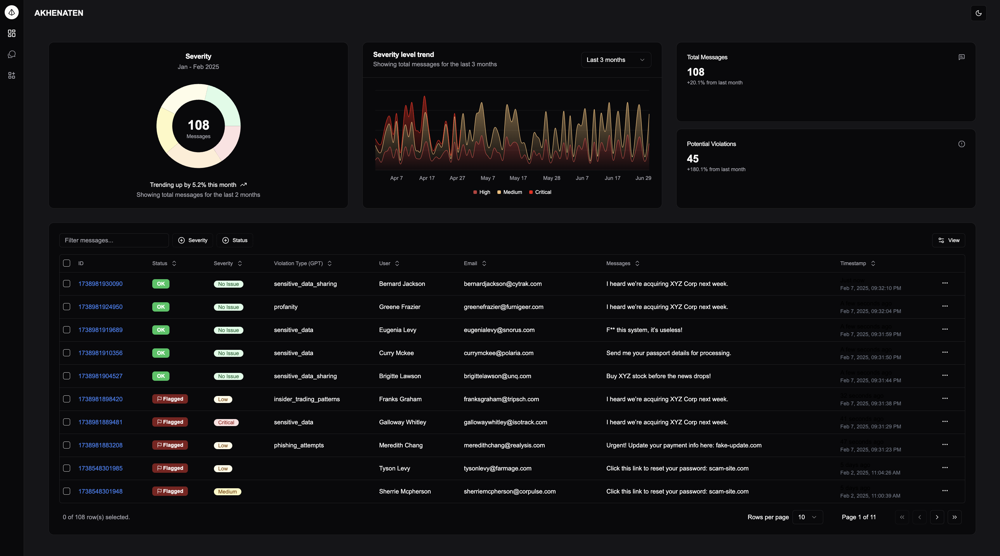
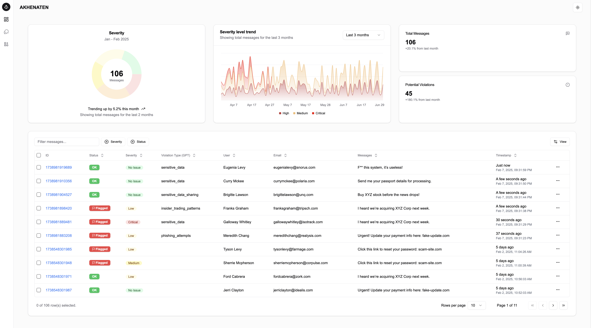
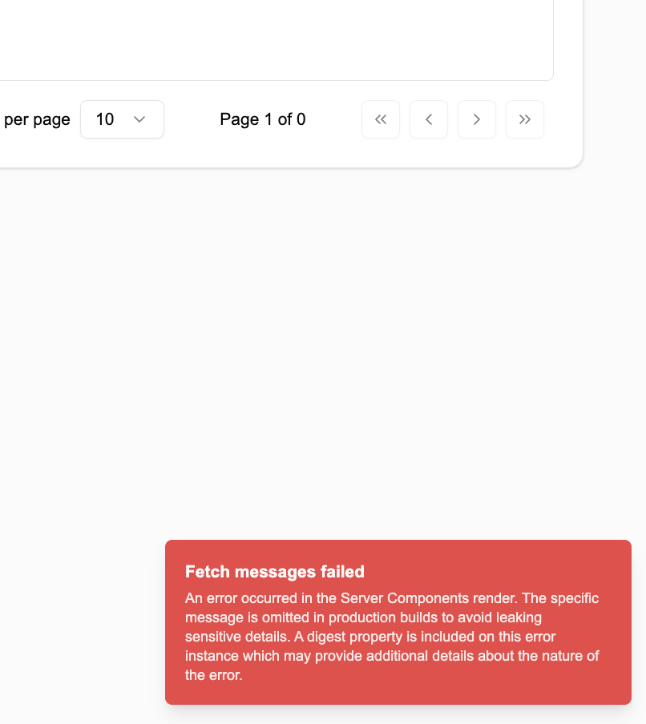
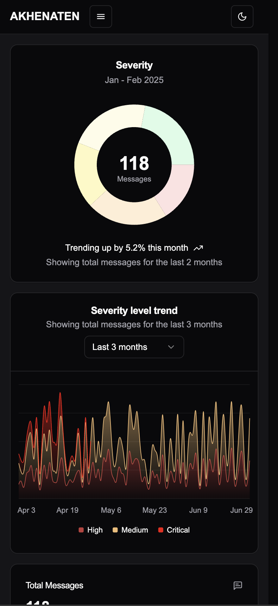
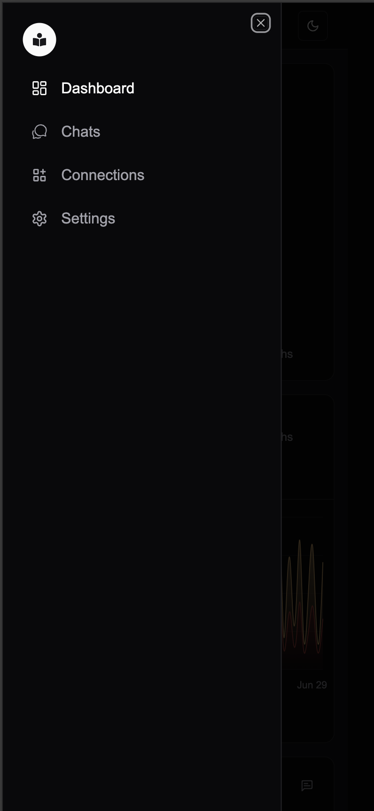
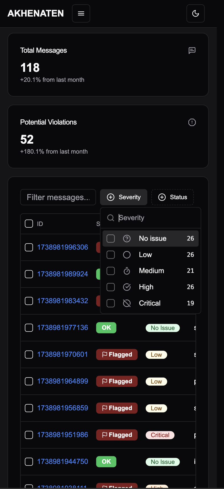
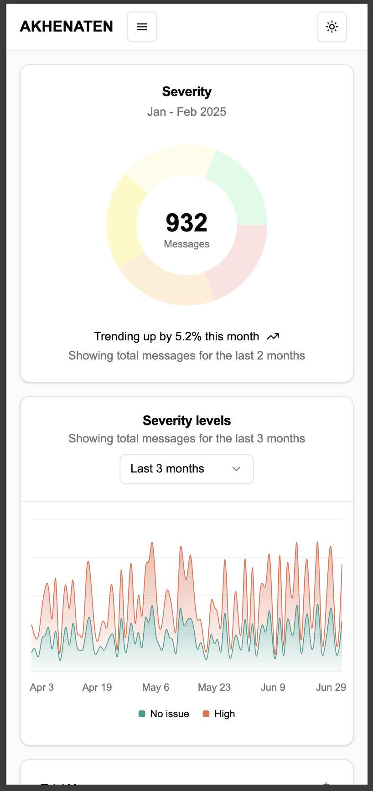
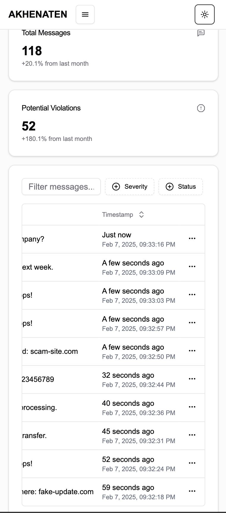

## Akhenaten security
#### Time for changing the world

Visit this [link](https://security-monitoring-orpin.vercel.app/dashboard) to see the live version of the app (Vercel).
[The backend repo](https://github.com/mivashchenko/express-openai-app/tree/security-dashboard). To check the live version click here [Heroku](https://vast-retreat-05206-d317ca74ea03.herokuapp.com/).

## Screen Shots
### Desktop

### Mobile

#### Error message

## Installation and Setup Instructions

[Backend](https://github.com/mivashchenko/express-openai-app/tree/security-dashboard) - setup the backend

Once the backend server is running please follow the instructions below:

`git clone https://github.com/mivashchenko/security-monitoring.git`

`pnpm install`

`pnpm run start`  

Once the server is running, visit:

`localhost:3000/dashboard`

# Project details

## Charts
The dashboard features two key charts:
- Severity Chart – Displays the severity levels of vulnerabilities based on real-time data.
- Severity Trend Chart – Tracks severity trends using mock data.

## Dashboard cards
Two summary cards provide key insights:
- total messages
- potential violations

## Messages table

### Toolbar
- Search messages
- Filter messages
- Toggle column visibility

### Table Functionality
- Displays all messages
- Efficient handling of large datasets
- Real-time updates

All the messages are filtered/sorted on the client side. The messages are fetched from the server and then filtered/sorted on the client side. The messages are updated in real-time using web sockets.

## Development Challenges & Solutions
The messages table was one of the most interesting yet challenging parts of the project. Initially, I considered using data virtualization, but I ultimately opted for pagination due to memory issues with real-time updates.
 
The pagination pattern is a good solution for the table with a large amount of data. It allows you to load only a small part of the data at a time.
But the backend should be able to provide the data for the table. In current implementation the backend provides the data for the table by running json-server. I just fetch the first 100 messages and then use web sockets to get a new data.
Ideally the backend should provide the data for the table by running a query to the database, after the new data processed by LLM and put into DB, and then send the data to the frontend through sockets as an option. But I didn't have time to implement this.
So I just use json-server to simulate the backend and sockets to get the new data by sending messages content to OpenAi.

One idea to enhance user experience is to pause WebSocket updates when the user is navigating through different pages of the table or selecting a row. Instead, the table could display a “Refresh Data” button to allow users to resume real-time updates. This would require a more structured architecture and additional development time.

## Other features
- Fully Responsive Design
- Dark Mode
- Snackbar Notifications for error messages

## LLM part
I’ve created an OpenAI assistant that can help analyze messages. It’s not perfect, but it’s a good start. For some reason, it sometimes makes mistakes. I need to experiment more with function calling to understand how it works.

Basically, I ask GPT to analyze a message and call a function with a single parameter, “violationType”. The function itself doesn’t perform any action, but I use the parameter to determine the type of violation.